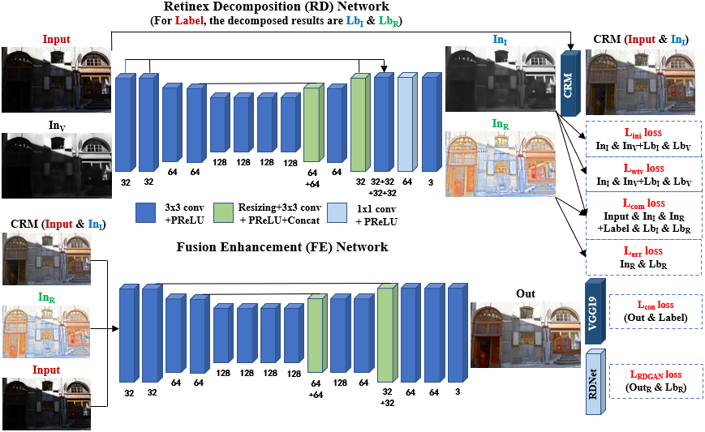
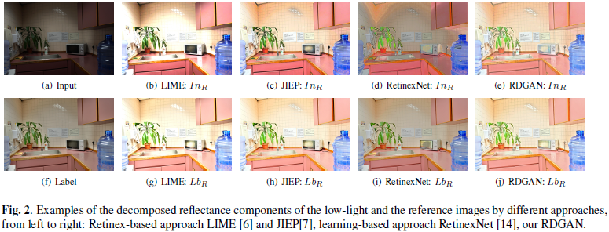
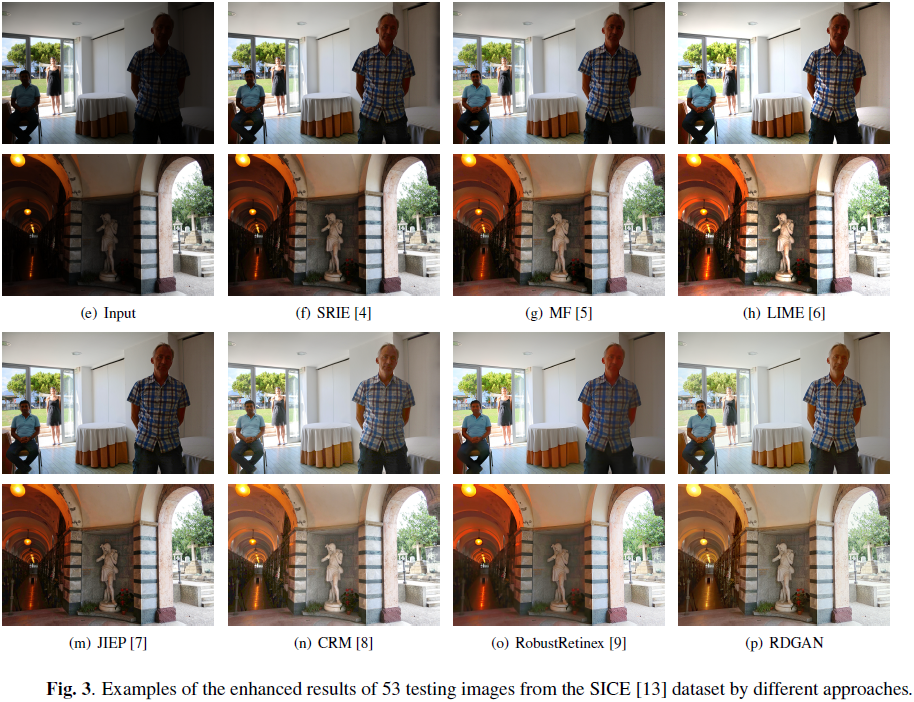

# RDGAN: Retinex Decomposition based Adversarial Learning for Low-Light Enhancement
[**ICME 2019 version**](https://ieeexplore.ieee.org/abstract/document/8785047)

[**ICME 2019 supplement material**](RDGAN_Supp.pdf)

[**ICME 2019 poster**](ICME_Poster.pdf)

## 1. Abstract
Pictures taken under the low-light condition often suffer from low contrast and loss of image details, thus an approach that can effectively improve low-light images is demanded. Traditional Retinex-based methods assume that the reflectance components of low-light images keep unchanged, which neglect the color distortion and lost details. In this paper, we propose an end-to-end learning-based framework that first decomposes the low-light image and then learns to fuse the decomposed results to obtain the high quality enhanced result. Our framework can be divided into a RDNet (Retinex Decomposition Network) for decomposition and a FENet (Fusion Enhancement Network) for fusion. Specific multi-term losses are respectively designed for the two networks. We also present a new RDGAN (Retinex Decomposition based Generative Adversarial Network) loss, which is computed on the decomposed reflectance components of the enhanced and the reference images. Experiments demonstrate that our approach is good at color and detail restoration, which outperforms other state-of-the-art methods.

## 2. Network Structure


## 3. Testing
Run [test.py](test.py) for results.

## 4. Retinex Decomposition Comparison


## 5. Low-Light Enhancement Comparison


## 6. Dataset
Following [SICE](https://github.com/csjcai/SICE).

See more testing images in the folder [samples_sup](samples_sup).

## 7. Citation
```
@inproceedings{RDGAN,
    author = {Wang, Junyi and Tan, Weimin and Niu, Xuejing and Yan, Bo},
    title = {RDGAN: Retinex Decomposition based Adversarial Learning for Low-Light Enhancement},
    booktitle = {IEEE International Conference on Multimedia and Expo (ICME)},
    year = {2019}
}
```
